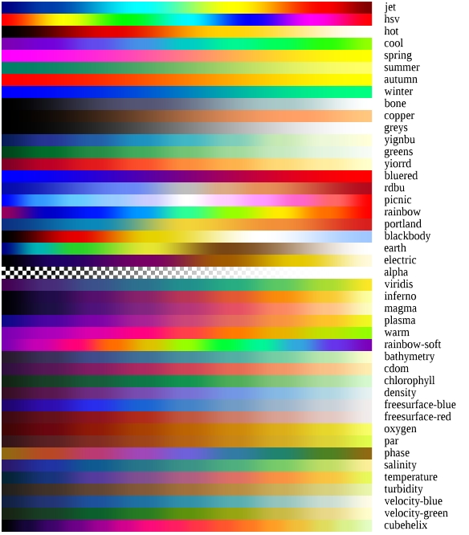

# glsl-colormap

colormaps for glsl shaders

Works best with [glslify][1].

[1]: https://github.com/stackgl/glslify



``` js
var glsl = require('glslify')
var regl = require('regl')()
var draw = regl({
  frag: glsl`
    precision mediump float;
    #pragma glslify: jet = require('glsl-colormap/jet')
    varying vec2 uv;
    void main () {
      gl_FragColor = jet(uv.x);
    }
  `,
  vert: `
    precision mediump float;
    attribute vec2 position;
    varying vec2 uv;
    void main () {
      uv = (position+1.0)*0.5;
      gl_Position = vec4(position,0,1);
    }
  `,
  attributes: {
    position: [-4,4,-4,-4,4,0]
  },
  count: 3
})
draw()
```

# api

```
#pragma glslify: jet = require("glsl-colormap/jet")
#pragma glslify: hsv = require("glsl-colormap/hsv")
#pragma glslify: hot = require("glsl-colormap/hot")
#pragma glslify: cool = require("glsl-colormap/cool")
#pragma glslify: spring = require("glsl-colormap/spring")
#pragma glslify: summer = require("glsl-colormap/summer")
#pragma glslify: autumn = require("glsl-colormap/autumn")
#pragma glslify: winter = require("glsl-colormap/winter")
#pragma glslify: bone = require("glsl-colormap/bone")
#pragma glslify: copper = require("glsl-colormap/copper")
#pragma glslify: greys = require("glsl-colormap/greys")
#pragma glslify: yignbu = require("glsl-colormap/yignbu")
#pragma glslify: greens = require("glsl-colormap/greens")
#pragma glslify: yiorrd = require("glsl-colormap/yiorrd")
#pragma glslify: bluered = require("glsl-colormap/bluered")
#pragma glslify: rdbu = require("glsl-colormap/rdbu")
#pragma glslify: picnic = require("glsl-colormap/picnic")
#pragma glslify: rainbow = require("glsl-colormap/rainbow")
#pragma glslify: portland = require("glsl-colormap/portland")
#pragma glslify: blackbody = require("glsl-colormap/blackbody")
#pragma glslify: earth = require("glsl-colormap/earth")
#pragma glslify: electric = require("glsl-colormap/electric")
#pragma glslify: alpha = require("glsl-colormap/alpha")
#pragma glslify: viridis = require("glsl-colormap/viridis")
#pragma glslify: inferno = require("glsl-colormap/inferno")
#pragma glslify: magma = require("glsl-colormap/magma")
#pragma glslify: plasma = require("glsl-colormap/plasma")
#pragma glslify: warm = require("glsl-colormap/warm")
#pragma glslify: rainbow-soft = require("glsl-colormap/rainbow-soft")
#pragma glslify: bathymetry = require("glsl-colormap/bathymetry")
#pragma glslify: cdom = require("glsl-colormap/cdom")
#pragma glslify: chlorophyll = require("glsl-colormap/chlorophyll")
#pragma glslify: density = require("glsl-colormap/density")
#pragma glslify: freesurface-blue = require("glsl-colormap/freesurface-blue")
#pragma glslify: freesurface-red = require("glsl-colormap/freesurface-red")
#pragma glslify: oxygen = require("glsl-colormap/oxygen")
#pragma glslify: par = require("glsl-colormap/par")
#pragma glslify: phase = require("glsl-colormap/phase")
#pragma glslify: salinity = require("glsl-colormap/salinity")
#pragma glslify: temperature = require("glsl-colormap/temperature")
#pragma glslify: turbidity = require("glsl-colormap/turbidity")
#pragma glslify: velocity-blue = require("glsl-colormap/velocity-blue")
#pragma glslify: velocity-green = require("glsl-colormap/velocity-green")
#pragma glslify: cubehelix = require("glsl-colormap/cubehelix")
```

# vec4 color = mapfn(float x)

Each function takes a single parameter `x` from `0` to `1` and returns a
`vec4(red,green,blue,alpha)`.

# install

```
npm install glsl-colormap
```

# license

BSD
